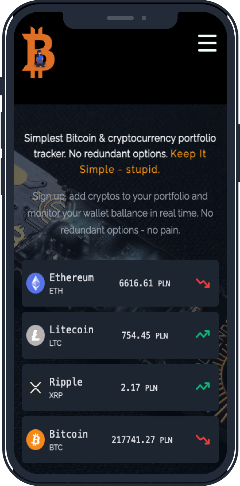
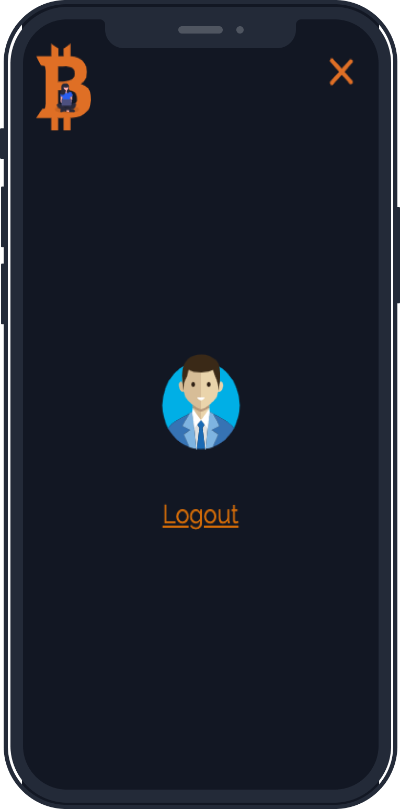
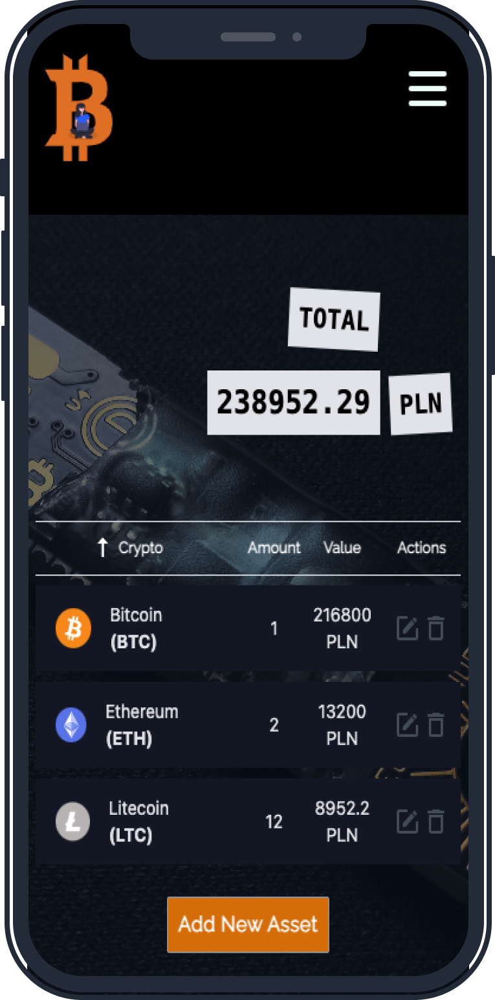

# simplest-crypto-portfolio - LIVE 💸

[https://simplest-crypto-portfolio.herokuapp.com/](https://simplest-crypto-portfolio.herokuapp.com/)

Simplest Bitcoin & cryptocurrency portfolio tracker without any redundant options.

## Technologies and tools used for building this project 🚀

- [react](https://reactjs.org) (with Hooks)
- [nextjs](https://nextjs.org/) for server side rendering
- [typescript](https://www.typescriptlang.org) for writing type safe code
- [lerna](https://lerna.js.org/) for managing mono repo
- [tailwind-css](https://tailwindcss.com/) library for basic styling
- [styled-components](https://styled-components.com) library for more complicated styling
- [hapi](https://hapi.dev/) as backend solution
- [postgreSQL](https://www.postgresql.org/) as database
- [prisma](https://www.prisma.io/) for managing database
- [figma](https://www.figma.com) for basic mockups
- [bitbay api](https://bitbay.net/en/public-api) for necessary data
- [heroku](https://www.heroku.com/) for hosting frontend and backend

It is fully responsible, made for mobile and desktop.

I hope you will enjoy it 😘.

## Example screenshoots

 

 

 

